# Chuck Norris Facts Finder

This application allows users to search for Chuck Norris facts using the [chucknorris.io API](https://api.chucknorris.io/).

## Features

- Search Chuck Norris facts by:
  - Keywords (text search)
  - Categories
  - Random facts
- Paginated results
- Search history storage in database
- Email functionality to send search results
- Available in English and Spanish
- Mobile-responsive design

## Technical Implementation

### Technology Stack

- Ruby on Rails 4.2
- SQLite database
- Bootstrap 4 for frontend styling
- Kaminari for pagination (version 1.2.2)
  - Used for paginating search results
  - Custom templates for bootstrap-compatible styling
- HTTParty for API requests (version 0.23.1)
  - Handles all communication with the Chuck Norris API
  - Used for fetching categories, search results, and random facts
- Rails i18n for internationalization
- Twilio SendGrid SMTP Relay for email delivery

### Project Structure

- `app/models/search.rb` - Handles search queries and saving search data
- `app/models/fact.rb` - Stores individual Chuck Norris facts
- `app/services/chuck_norris_api.rb` - Service to interact with the Chuck Norris API using HTTParty
- `app/mailers/facts_mailer.rb` - Handles sending search results via email
- `app/controllers/searches_controller.rb` - Controller for search functionality
- `config/locales/` - Contains the language files for English and Spanish
- `app/views/kaminari/` - Contains custom pagination templates for the Kaminari gem

## Email Configuration

This application uses the SendGrid API to send search results via email. The `.env` file is already included at `src/.env` - you just need to replace the placeholder values with your actual SendGrid credentials:

```
# MAIL
SENDGRID_API_KEY=your_sendgrid_api_key_here
MAILER_FROM_EMAIL=your_from_email_here
```

**Important**: Make sure to update these values before building the Docker image or starting the application.

## How to Run

### Using Docker

1. Create a `.env` file with your SendGrid configuration (see above)
2. Build and start the container:
   ```
   docker-compose up -d
   ```
3. Access the application at http://localhost:3000

### Manual Setup

1. Make sure you have Ruby and Rails installed on your machine
2. Clone this repository
3. Navigate to the project directory
4. Create a `.env` file with your SendGrid configuration
5. Run `bundle install` to install dependencies
6. Run `bin/rake db:migrate` to set up the database
7. Run `bin/rails server` to start the development server
8. Visit `http://localhost:3000` in your browser

## Screenshots

The `/screenshots` directory contains images showing the application in action:

### Main Interface
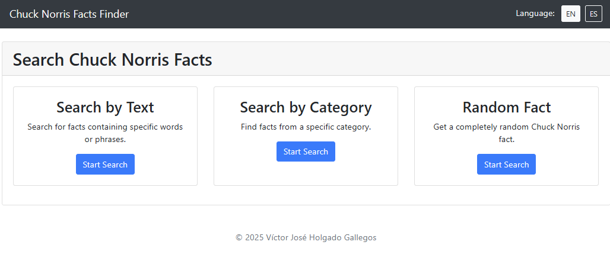
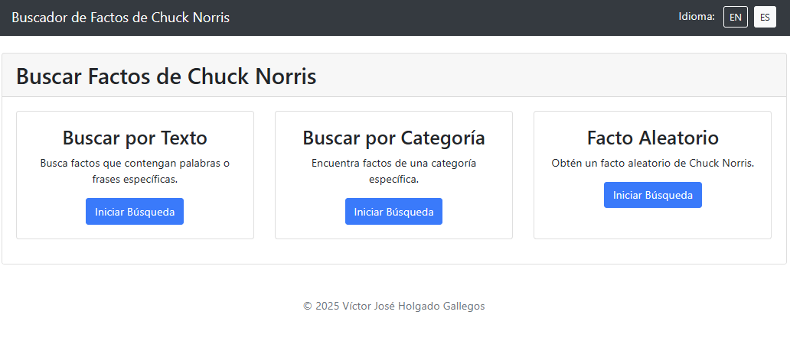

### Text Search
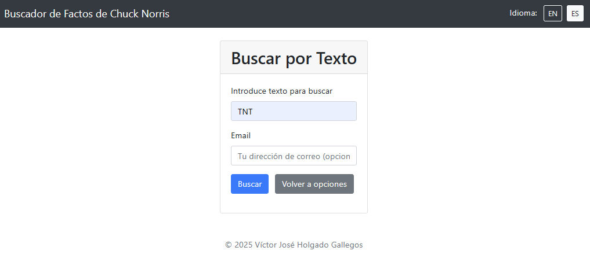
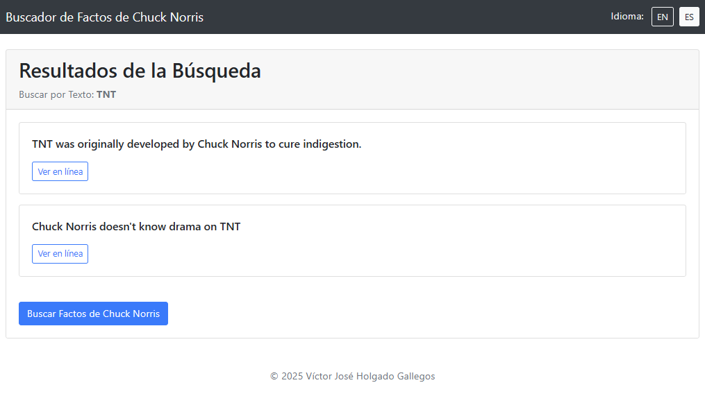
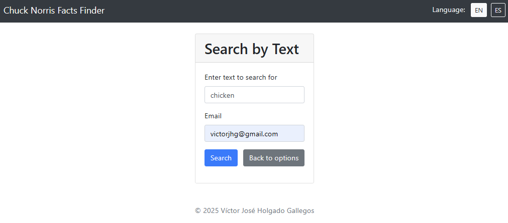
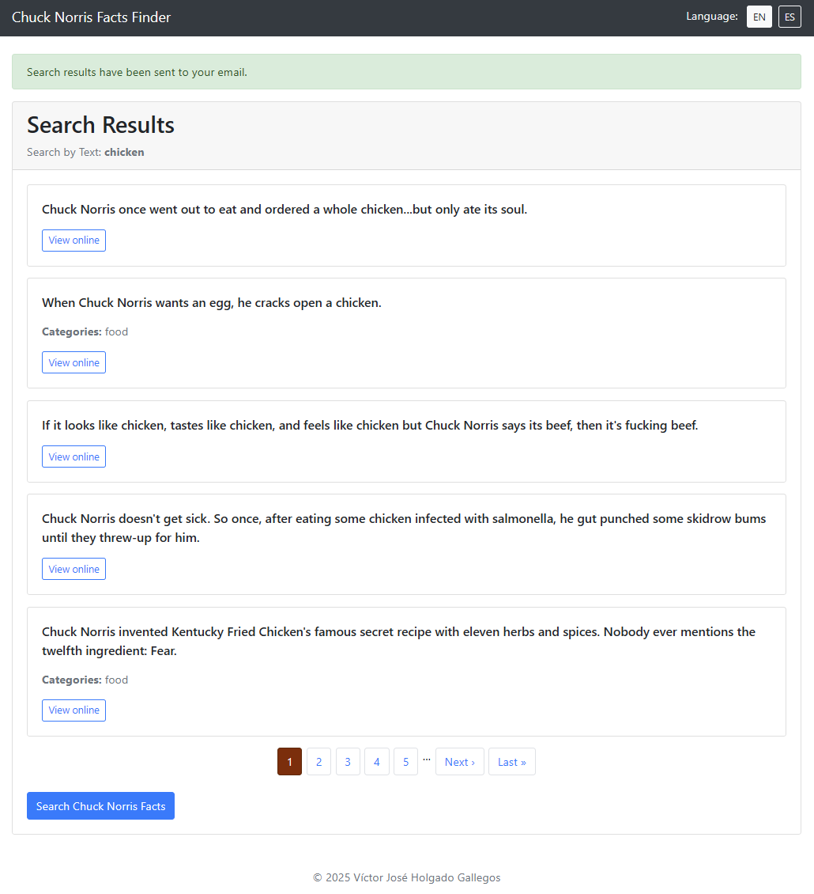
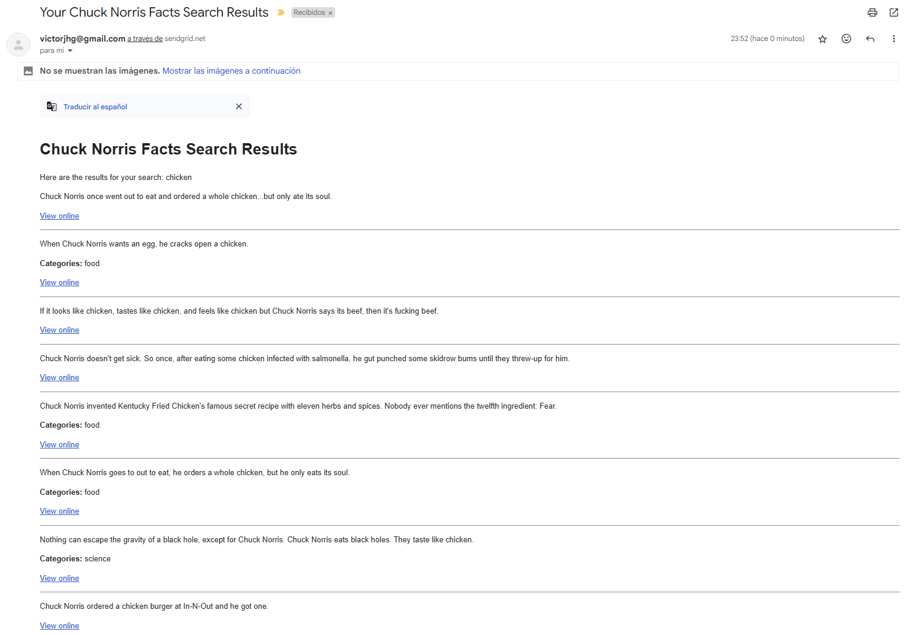

### Category Search
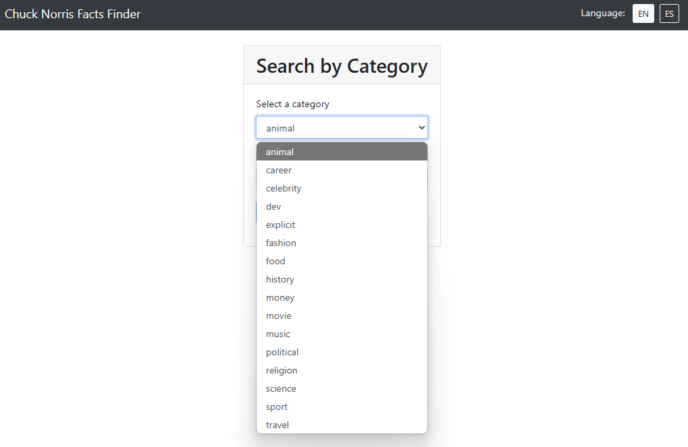
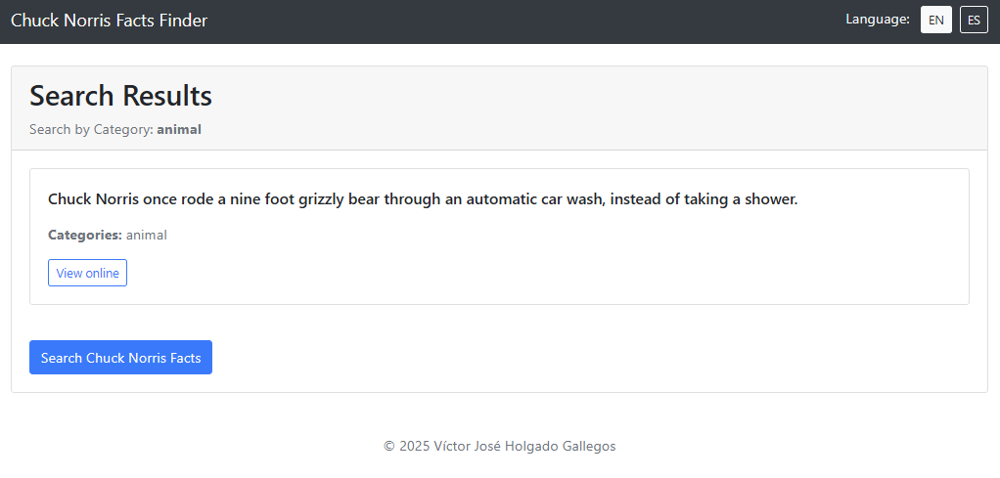

### Random Search
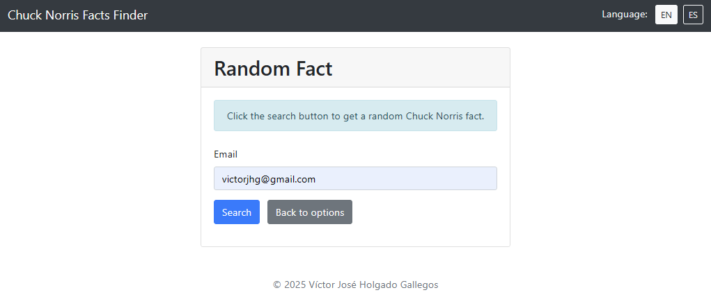
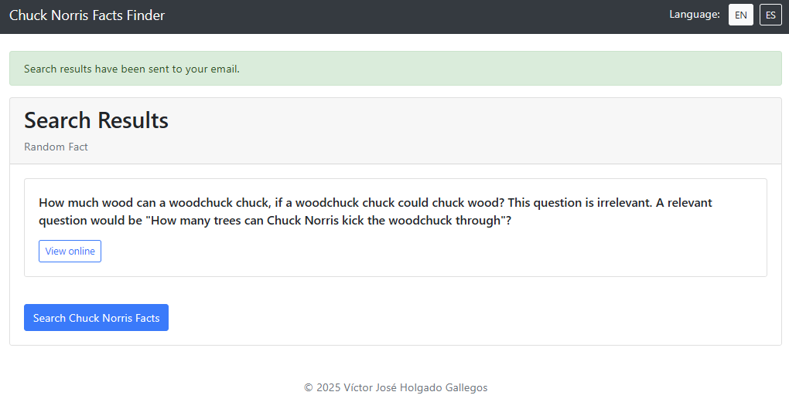
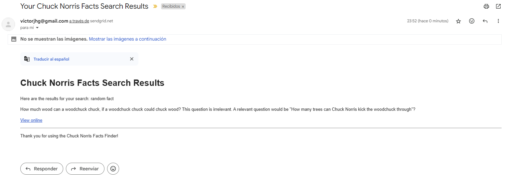

## Solution Overview

This application was developed as a response to the requirement of creating a Chuck Norris facts search engine. The solution includes:

- A clean, responsive UI using Bootstrap 4
- Three different search methods (text, category, and random)
- Email functionality to deliver search results to users
- Multilingual support (English and Spanish)
- Complete storage of search history and results in the database
- Integration with the chucknorris.io API

The application was designed with simplicity and user experience in mind, focusing on making the search process intuitive while maintaining all the required functionality.
